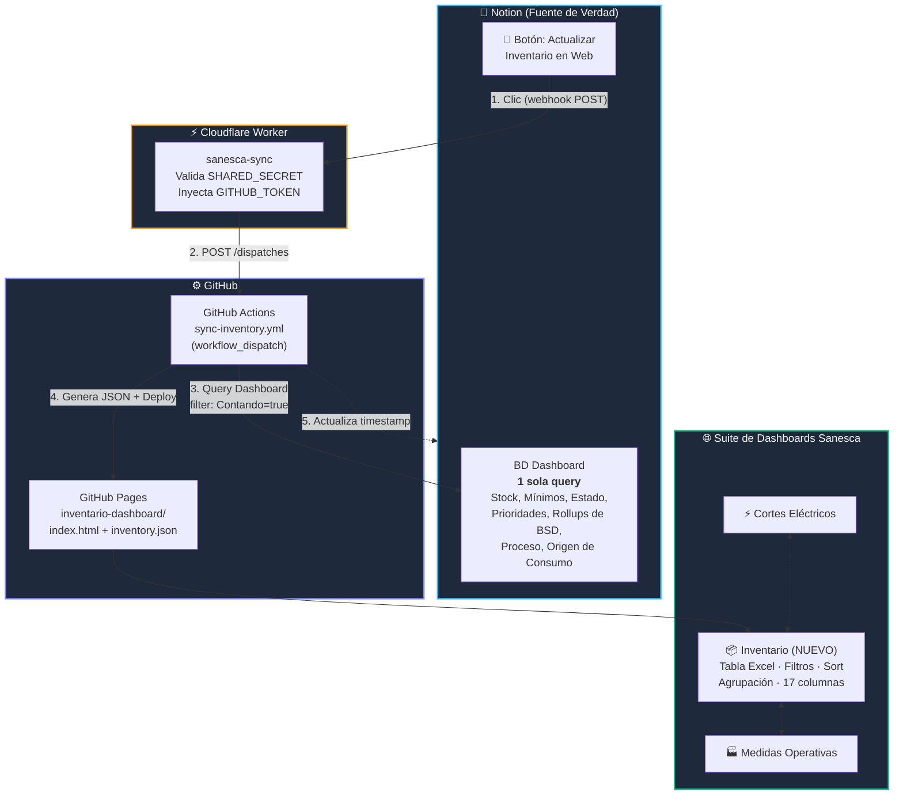

# Plan de Implementación v3: Dashboard de Inventario Sanesca

> **Proyecto:** Tablero web de solo lectura para la Gerencia de Operaciones de Sanesca.
**Repositorio:** `Arquitectura-Mantenimiento/07_Web/` (subcarpeta nueva: `inventario-dashboard/`)
**Conversaciones:** Exploración inicial → Definición actual
> 

### Documentos Compañeros

| Documento | Propósito | Estado |
| --- | --- | --- |
| pre_fase1_propiedades_interfaz.md | Inventario de propiedades de Notion → mapeo a la web | En revisión |
| specs_frontend.md | Especificaciones funcionales del frontend (features) | Aprobado |

---

## Changelog

| Versión | Fecha | Cambios |
| --- | --- | --- |
| **v1** | 2026-08-28 | Plan inicial con 4 componentes y 6 preguntas abiertas |
| **v2** | 2026-08-28 | Todas las preguntas cerradas. Ecosistema existente descubierto. 5 fases con estimaciones de interacciones |
| **v3** | 2026-08-29 | **Re-extracción de schemas post-auditoría del usuario.** 7 propiedades convertidas a rollups. Estado de Stock simplificado (10→5 opciones). 3 propiedades nuevas, 8 eliminadas. `Contando` descubierto como filtro de visibilidad web. Specs funcionales creadas (estilo Excel/Notion). Fase 1 redefinida con features concretas. Fase 2 simplificada a 1 query. Pre-Fase 0 agregada. Mobile confirmado como tabla (no tarjetas). Botón Copiar Requisición eliminado |

---

## Decisiones Cerradas

| # | Decisión | Selección | Fuente |
| --- | --- | --- | --- |
| 1 | Patrón de Arquitectura | SSG + GitHub Pages | Exploración previa |
| 2 | Disparador | Manual — botón webhook en Notion (compatible con móvil) | Entrevista /grill-me |
| 3 | Puente webhook | Cloudflare Worker (`sanesca-sync`) — MCP verificado ✅ | Verificación en vivo |
| 4 | Fuentes de datos | BD `Dashboard` (1 query si se agregan 2 rollups) | Decisión v3 |
| 5 | Feedback de sincronización | Badge en web + timestamp en Notion | Entrevista /grill-me |
| 6 | Acceso | URL directa sin autenticación | Entrevista /grill-me |
| 7 | Diseño UI | Diseño primero con StitchMCP (desktop + mobile) | Confirmado v3 |
| 8 | Lenguaje del script | Node.js (`@notionhq/client`) | Confirmado |
| 9 | Repositorio | `Arquitectura-Mantenimiento` con nav cruzada | Confirmado |
| 10 | Integración Notion | `sanescatoken` (con acceso a Dashboard y BSD) | Confirmado |
| 11 | Token de GitHub | Reutilizar el PAT existente | Confirmado |
| 12 | SHARED_SECRET | Sí, validación de origen en el Worker | Confirmado |
| 13 | Estilo de interfaz | **Tabla tipo Excel** — sin panel lateral, sin tarjetas mobile | v3 |
| 14 | Features de la tabla | Filtros avanzados + Quick filters + Sort multinivel + Agrupación + Visibilidad de columnas | v3 — specs |
| 15 | Botón Copiar Requisición | **❌ Eliminado** — el gerente solo consulta | v3 |
| 16 | `Contando` | **Filtro de visibilidad** — solo `Contando=true` se publica en web | v3 |
| 17 | Columnas nuevas | `Proceso`, `Grupo de Proceso`, `Origen de Consumo` → columnas web | v3 |
| 18 | Propiedades innecesarias | `Tienda`, `Solicitudes de Insumos`, `Cantidad Solicitada`, `Fecha de Solicitud` → excluidas | v3 |

---

## Arquitectura del Sistema (Actualizada v3)



> [!TIP]
**Cambio clave vs. v2:** Ya no hay query separada a BSD. Las 7 propiedades convertidas a rollups + los 2 rollups pendientes (Categoría, Rol) permiten extraer todo con **1 sola query al Dashboard** filtrada por `Contando = true`.
> 

---

## Estructura de Archivos (sin cambios vs. v2)

```
Arquitectura-Mantenimiento/
└── 07_Web/
    ├── sanesca-dashboard/          ← (existente: Cortes Eléctricos)
    ├── medidas-operativas/         ← (existente: Medidas Operativas)
    └── inventario-dashboard/       ← NUEVO
        ├── .github/workflows/
        │   └── sync-inventory.yml    [NEW]
        ├── scripts/
        │   └── fetch-inventory.js    [NEW]
        ├── data/
        │   ├── inventory.json        [GENERATED]
        │   └── meta.json             [GENERATED]
        ├── assets/
        │   └── logo-sanesca.png      [COPY]
        ├── index.html                [NEW]
        ├── package.json              [NEW]
        ├── .env.example              [NEW]
        ├── .gitignore                [NEW]
        └── README.md                 [NEW]
```

Archivos existentes a modificar: `sanesca-dashboard/index.html` y `medidas-operativas/index.html` (agregar link `📦 Inventario ↗`).

---

## Fases de Ejecución

### Roadmap

```mermaid
gantt
    title Roadmap por Interacciones
    dateFormat X
    axisFormat Interacción %s

    section Pre-Fase 0
    Crear rollups en Notion (usuario)       :f0, 0, 1

    section Fase 1 · Diseño
    StitchMCP Desktop + Mobile + Revisión   :f1, 1, 2

    section Fase 2 · Extracción
    fetch-inventory.js + Test local         :f2, 2, 3

    section Fase 3 · Integración Web
    index.html con features Excel/Notion    :f3, 3, 5

    section Fase 4 · Pipeline
    Worker + Actions + Botón Notion         :f4, 5, 7

    section Fase 5 · Validación
    Test E2E + Docs + Walkthrough           :f5, 7, 8
```



| Fase | Interacciones | Contenido |
| --- | --- | --- |
| **F0: Pre-requisitos** | 0 (usuario) | Crear 2 rollups en Notion |
| **F1: Diseño Visual** | 1 | StitchMCP: desktop + mobile, revisar, iterar |
| **F2: Script Extractor** | 1 | `fetch-inventory.js` con 1 query, test local |
| **F3: Integración Web** | 1-2 | `index.html` con todos los features (filtros, sort, agrupación, columnas) |
| **F4: Pipeline** | 1-2 | Worker CF + GitHub Actions + Botón Notion |
| **F5: Validación** | 1 | E2E, documentación, walkthrough |
| **Total** | **5-8 interacciones** | — |

---

### Pre-Fase 0: Requisitos en Notion — *Acción del usuario*

**Objetivo:** Crear los 2 rollups faltantes para que el script funcione con 1 sola query.

**Acciones del usuario en Notion:**

1. Abrir la BD **Dashboard**
2. Crear propiedad rollup **`Categoría de material`**:
    - Relación: `Producto`
    - Propiedad: `Categoría de material`
    - Función: `Show original`
3. Crear propiedad rollup **`Rol del Material`**:
    - Relación: `Producto`
    - Propiedad: `Rol del Material`
    - Función: `Show original`

**Criterio de aceptación:**

- [ ]  Ambos rollups visibles en la BD Dashboard con datos correctos

---

### Fase 1: Diseño Visual con StitchMCP — *Interacción 1*

**Objetivo:** Generar propuesta visual desktop + mobile y validarla.

**Acciones:**

1. Crear proyecto en StitchMCP
2. Generar pantalla **DESKTOP** con prompt técnico basado en las specs funcionales:
    - Estilo **Excel/tabla densa** con Design System Sanesca (slate-950, Geist font)
    - Header con nav cruzada + badge de última sync
    - 5 tarjetas KPI: Sin Stock, Bajo Mínimo, En Stock, En Reconteo, Auditados 3D
    - Barra de herramientas: búsqueda, vista compacta/ampliada, selector columnas, filtrar, ordenar, agrupar, reset
    - Filtros rápidos como badges toggle (Estado + Prioridad)
    - Tabla full-width con encabezados sticky, vista compacta por defecto (Nombre, Stock, Mínimo)
    - Footer mínimo sin links a Notion
3. Generar pantalla **MOBILE**: misma tabla con scroll horizontal, barra apilada, KPIs en grid 2×2
4. Revisar ambas pantallas contigo e iterar

**Criterios de aceptación:**

- [ ]  Pantalla desktop coherente con Design System y specs funcionales
- [ ]  Pantalla mobile con tabla (no tarjetas) y scroll horizontal
- [ ]  Aprobación visual del usuario

---

### Fase 2: Script Extractor — *Interacción 2*

**Objetivo:** Script que extrae datos del Dashboard con 1 query y genera JSON.

**Acciones:**

1. Crear subcarpeta `inventario-dashboard/` con `package.json`
2. Escribir `scripts/fetch-inventory.js`:
    - **1 query** a BD Dashboard con filtro `Contando = true`
    - Extraer 17 propiedades (ver catálogo de columnas)
    - Resolver rollups (Categoría, Rol, Marca, Código, Unidad, L×A×E, Color, Departamentos, Grupo de Proceso)
    - Calcular campos derivados: déficit, cobertura_pct, semáforo, dimensiones_fmt, dias_desde_reconteo
    - Generar `data/inventory.json` + `data/meta.json`
3. Ejecutar localmente con `SANESCATOKEN`
4. Validar el JSON generado

**Criterios de aceptación:**

- [ ]  `npm run fetch` ejecuta sin errores
- [ ]  JSON contiene solo ítems con `Contando = true`
- [ ]  17 columnas del catálogo presentes con datos correctos
- [ ]  Campos derivados calculados correctamente
- [ ]  `meta.json` contiene `lastSync`, `itemCount`, `buildStatus`

---

### Fase 3: Integración Web — *Interacciones 3-4*

**Objetivo:** `index.html` funcional con todos los features tipo Excel/Notion.

> [!IMPORTANT]
Esta fase puede requerir 2 interacciones dado que implementa 7 features complejos definidos en las specs.
> 

**Acciones (Interacción 3):**

1. Estructura HTML base: Header + KPIs + Barra de herramientas + Tabla + Footer
2. Alpine.js: carga de `inventory.json`, renderizado de tabla, vista compacta/ampliada
3. Feature: Selector de columnas (⚙ checkboxes)
4. Feature: Ordenamiento por columna (clic en header, ciclo ↕→↑→↓)
5. Feature: Búsqueda de texto libre

**Acciones (Interacción 4):**
6. Feature: Filtros rápidos (badges toggle Estado + Prioridad)
7. Feature: Filtros avanzados (panel con reglas propiedad+operador+valor, AND/OR)
8. Feature: Ordenamiento multinivel (panel con hasta 3 niveles)
9. Feature: Agrupación (subheaders colapsables por select/status)
10. Feature: Botón Reset global
11. Navegación cruzada en los 3 dashboards

**Criterios de aceptación:**

- [ ]  Todos los 7 features funcionales según specs
- [ ]  Vista compacta (3 columnas) funcional en mobile sin scroll
- [ ]  Vista ampliada con scroll horizontal en mobile
- [ ]  3 dashboards con nav cruzada funcional
- [ ]  Rendimiento aceptable (~216 ítems, todo client-side)

---

### Fase 4: Pipeline Completo — *Interacciones 5-6*

**Objetivo:** Flujo end-to-end: Botón Notion → Worker → GitHub Actions → Deploy.

#### Fase 4A: Worker + Actions *(Interacción 5)*

**Acciones:**

1. Crear Worker `sanesca-sync` vía Cloudflare MCP
2. Crear workflow `sync-inventory.yml` con `workflow_dispatch`
3. Configurar GitHub Secrets si es necesario
4. Test manual: disparar workflow desde GitHub UI

**Criterios:** Worker desplegado, workflow funcional, web actualizada.

#### Fase 4B: Botón Notion *(Interacción 6)*

**Acciones:**

1. Crear botón/automatización en Notion con URL del Worker
2. Configurar feedback de timestamp en Notion
3. Test: clic en botón → cadena completa funciona

**Criterios:** Botón funciona en desktop y móvil, timestamp se actualiza.

---

### Fase 5: Validación E2E y Cierre — *Interacción 7(-8)*

**Objetivo:** Validación completa, documentación, entrega.

**Acciones:**

1. Test E2E: cambiar dato en Notion → clic botón → verificar web
2. Test de resiliencia: error de Notion, doble clic
3. Documentación: README + guía operativa
4. Navegación cruzada verificada en producción
5. Walkthrough final con capturas

**Criterios:**

- [ ]  Flujo E2E < 90 segundos
- [ ]  Web correcta con todos los features
- [ ]  README y guía operativa completos
- [ ]  Walkthrough con evidencia visual

---

## Riesgos y Mitigaciones (Actualizado v3)

| Riesgo | Prob. | Impacto | Mitigación |
| --- | --- | --- | --- |
| Rollups devuelven arrays truncados (>25 ítems) | Baja | Datos parciales | Rollups con `show_original` devuelven valor directo, no array de relaciones |
| Plan de Notion no soporta botón webhook directo | Media | Bloquea F4B | Alternativa: automatización con checkbox trigger |
| Rate limit de Notion (3 req/seg) | Baja | Script lento | 1 sola query + paginación = <5 segundos |
| Doble clic accidental en botón | Baja | Workflows duplicados | `concurrency: cancel-in-progress: true` |
| Fase 3 excede 2 interacciones por complejidad de features | Media | Retraso | Features priorizados: F3a (core) → F3b (avanzados) |

---

## Costo Total

| Servicio | Costo |
| --- | --- |
| GitHub Pages + Actions | \$0 |
| Cloudflare Workers (100K req/día gratis) | \$0 |
| Notion API | \$0 |
| **Total mensual** | **\$0** |